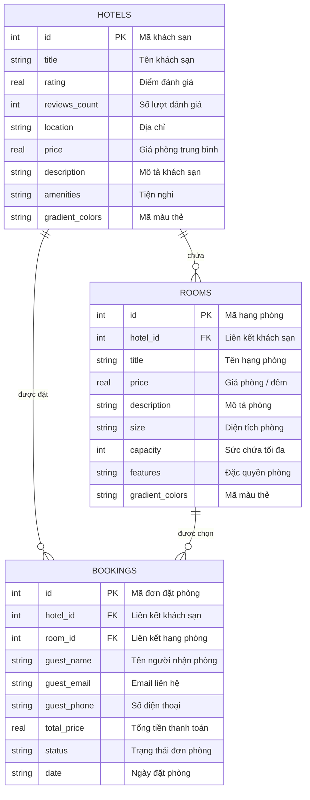
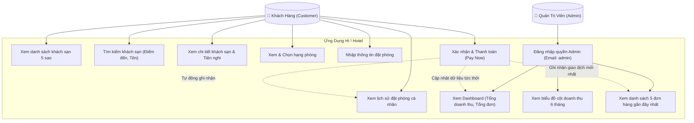

# Biểu đồ Thực thể Liên kết (ERD) & Ca Sử Dụng (Use Case Diagram) - Hi ! Hotel

Tài liệu này cung cấp các biểu đồ thiết kế hệ thống của ứng dụng **Hi ! Hotel** được mô tả và vẽ trực quan bằng cú pháp **Mermaid**.

---

## 1. Biểu đồ Thực thể Liên kết (Entity Relationship Diagram - ERD)

Biểu đồ dưới đây thể hiện cấu trúc quan hệ giữa các bảng trong cơ sở dữ liệu SQLite:
* Một khách sạn (`hotels`) có nhiều hạng phòng (`rooms`) (Quan hệ `1 - Nhiều`).
* Một khách sạn (`hotels`) xuất hiện trong nhiều đơn đặt phòng (`bookings`) (Quan hệ `1 - Nhiều`).
* Một hạng phòng (`rooms`) xuất hiện trong nhiều đơn đặt phòng (`bookings`) (Quan hệ `1 - Nhiều`).

---

## 2. Biểu đồ Ca Sử Dụng (Use Case Diagram)

Sơ đồ thể hiện sự tương tác của hai đối tượng người dùng chính trong hệ thống: **Khách hàng (Customer)** và **Quản trị viên (Admin)** đối với các chức năng chính của ứng dụng.

