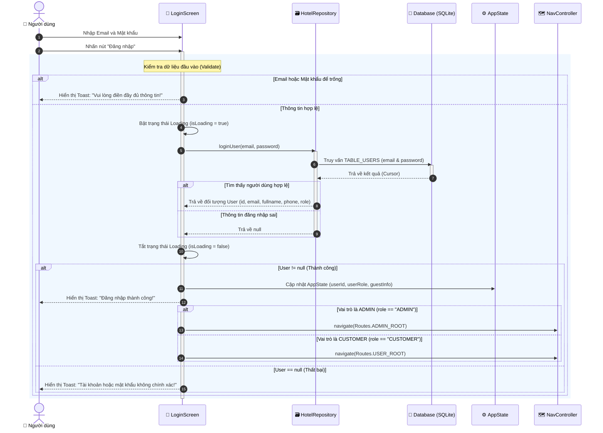
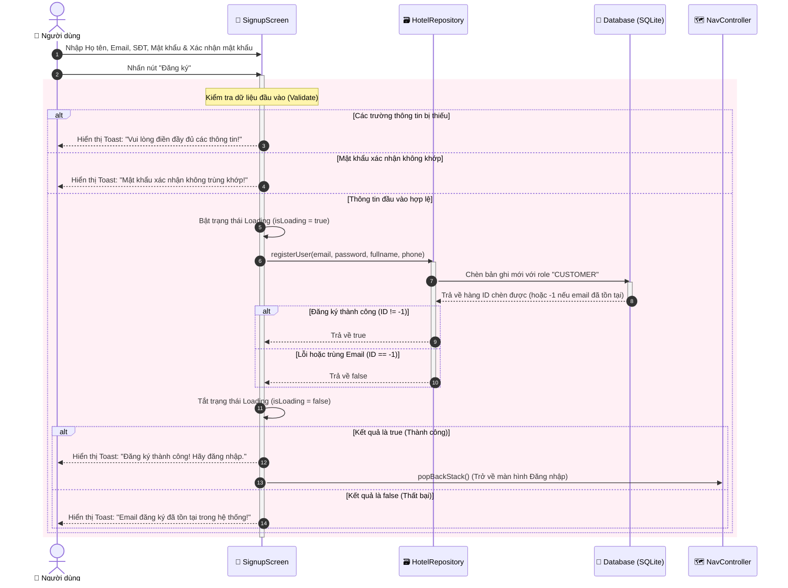

# Biểu đồ Ca Tuần Tự (Sequence Diagram) - Đăng Nhập & Đăng Ký

Tài liệu này mô tả chi tiết luồng xử lý và tương tác giữa các thành phần trong hệ thống khi người dùng thực hiện chức năng **Đăng nhập** và **Đăng ký** trên ứng dụng **Hi ! Hotel**.

---

## 1. Biểu đồ Ca Tuần Tự: Đăng Nhập (Login Sequence Diagram)

Biểu đồ dưới đây thể hiện luồng tương tác từ giao diện người dùng (`LoginScreen`) qua lớp dữ liệu (`HotelRepository`, `DatabaseHelper`) đến cơ sở dữ liệu SQLite, cũng như các nhánh rẽ hướng điều hướng dựa trên vai trò của người dùng (`CUSTOMER` hoặc `ADMIN`).

---

## 2. Biểu đồ Ca Tuần Tự: Đăng Ký (Signup Sequence Diagram)

Biểu đồ dưới đây mô tả luồng đăng ký tài khoản mới cho Khách hàng (`CUSTOMER`). Hệ thống sẽ kiểm tra trùng lặp email và thực hiện lưu trữ thông tin mới vào cơ sở dữ liệu.

